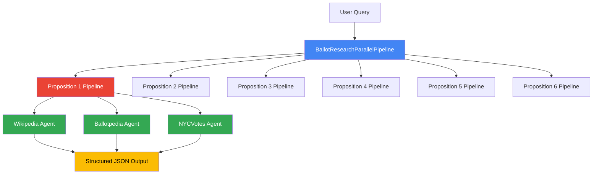
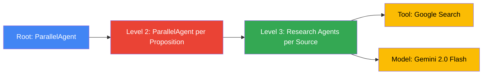
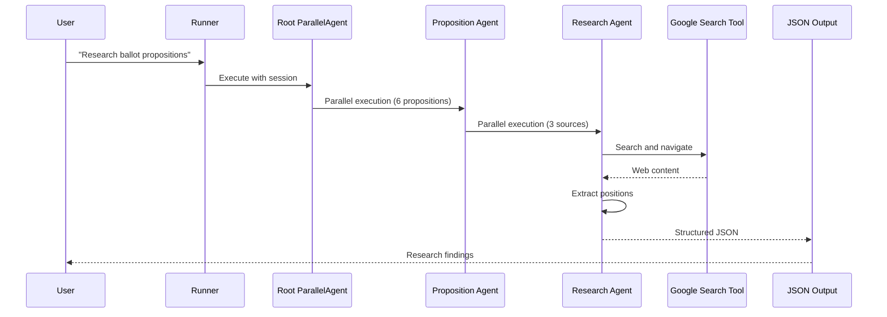

# Ballot Research Agent System

A multi-agent system built with Google's Agent Development Kit (ADK) that autonomously researches ballot propositions and identifies organizations and individuals who have taken positions on them.

## 📋 Table of Contents

- [Problem Statement](#problem-statement)
- [Solution Overview](#solution-overview)
- [Architecture](#architecture)
- [Setup Instructions](#setup-instructions)
- [Usage](#usage)
- [Project Structure](#project-structure)
- [Technical Details](#technical-details)
- [Known Issues](#known-issues)
- [License](#license)

## 🎯 Problem Statement

During election cycles, voters face a significant challenge: understanding complex ballot propositions and determining who supports or opposes them. This information is typically:

- **Scattered** across multiple websites (Wikipedia, Ballotpedia, government sites)
- **Buried** within dense political commentary
- **Inconsistently formatted** across different sources
- **Time-consuming** to research manually

For the 2025 NYC general election with 6 ballot propositions, manually researching each proposition's supporters and opponents across multiple sources would require:
- Visiting dozens of web pages
- Following numerous hyperlinks
- Tracking and deduplicating entities
- Distinguishing between organizations and individual spokespeople
- Formatting results consistently

**This system automates that entire process.**

## 💡 Solution Overview

This project uses a **hierarchical multi-agent system** where:

1. **Parallel Processing**: Multiple propositions are researched simultaneously
2. **Source Specialization**: Dedicated agents for each information source (Wikipedia, Ballotpedia, NYCVotes)
3. **Autonomous Navigation**: Agents follow links and make decisions about which pages to explore
4. **Structured Output**: All findings are extracted as consistent JSON with strict validation rules

### Why Agents?

Agents are ideal for this task because they provide:
- **Autonomous decision-making** for web navigation
- **Tool use** (Google Search) for dynamic information gathering
- **Parallel execution** for speed
- **Instruction following** for consistent data extraction
- **Scalability** to new propositions or sources

## 🏗️ Architecture

### System Overview



### Agent Hierarchy



### Data Flow



### ADK Concepts Utilized

| Concept | Implementation |
|---------|----------------|
| **LLM-Powered Agents** | Each research agent uses Gemini 2.0 Flash for intelligent decision-making |
| **Parallel Agents** | Two levels of parallelism: proposition-level and source-level |
| **Built-in Tools** | `google_search` tool for autonomous web navigation |
| **Sessions & State** | `InMemorySessionService` for managing agent state |
| **Observability** | Logging and status tracking throughout execution |
| **Retry Logic** | HTTP retry with exponential backoff for API reliability |

## 🚀 Setup Instructions

### Prerequisites

- Python 3.10+
- Google Cloud API access with Gemini API enabled
- Internet connection for web research

### Step 1: Clone the Repository

```bash
git clone https://github.com/YOUR_USERNAME/ballot-research.git
cd ballot-research
```

### Step 2: Install Dependencies

```bash
pip install -r requirements.txt
```

Required packages:
```
google-genai
google-adk
python-dotenv
aiohttp
```

### Step 3: Set Up API Keys

Create a `.env` file in the project root:

```bash
GOOGLE_API_KEY=your_gemini_api_key_here
```

Or set as environment variable:
```bash
export GOOGLE_API_KEY="your_gemini_api_key_here"
```

### Step 4: Verify Setup

```bash
python verify_agents.py
```

You should see:
```
✅ Gemini API key setup complete.
✅ ADK components imported successfully.
✅ Helper functions defined.
✅ 6 Research Pipelines created.
✅ Sequential Agent created.
```

## 📖 Usage

### Basic Usage

Run the complete research pipeline:

```bash
python run_research.py
```

This will:
1. Initialize all agents (currently configured for Proposition 1)
2. Execute research across all sources in parallel
3. Extract and format findings as JSON
4. Resolve redirect URLs to actual sources
5. Save output to two files:
   - `ballot_research_output_original.txt` - Raw agent output
   - `ballot_research_output_resolved.txt` - With URLs resolved

### Expected Output Format

Each finding is structured as JSON:

```json
{
  "Source": "Wikipedia",
  "URL": "https://en.wikipedia.org/wiki/2025_New_York_City_ballot_proposals",
  "Proposal": 1,
  "Entity": "Protect the Adirondacks, Inc.",
  "Description": "Organization focused on protecting the Adirondack region",
  "Type": "Organization",
  "Position": "Yes"
}
```

### Customizing Research

#### Research Specific Propositions

Edit `agent.py` line 87:
```python
# Research only Proposition 1
pipelines = [create_ballot_pipeline(i) for i in range(1, 2)]

# Research all 6 propositions (may hit rate limits)
pipelines = [create_ballot_pipeline(i) for i in range(1, 7)]
```

#### Add New Sources

Edit `agent.py` line 78:
```python
research_agents = [
    create_research_agent(index, "Wikipedia"),
    create_research_agent(index, "Ballotpedia"),
    create_research_agent(index, "NYCVotes"),
    create_research_agent(index, "YourNewSource")  # Add here
]
```

Then create `yournewsource_research.txt` with instructions.

#### Modify Agent Instructions

Edit the instruction template files:
- `ballot_research_instructions_p{1-6}.txt` - Proposition-specific context
- `template_target_research.txt` - General research guidelines
- `wikipedia_research.txt` - Source-specific instructions

## 📁 Project Structure

```
ballot_research/
├── README.md                              # This file
├── agent.py                               # Main agent definitions
├── run_research.py                        # Execution script
├── util.py                                # Helper functions
├── .env                                   # API keys (not in repo)
├── .gitignore                             # Git ignore rules
│
├── ballot_research_instructions_p{1-6}.txt  # Proposition context
├── template_target_research.txt           # Research template
├── wikipedia_research.txt                 # Wikipedia instructions
├── ballotpedia_research.txt              # Ballotpedia instructions
├── nycvotes_research.txt                 # NYCVotes instructions
│
├── ballot_research_output_original.txt   # Raw output
└── ballot_research_output_resolved.txt   # Processed output
```

## 🔧 Technical Details

### Agent Configuration

**Model**: Gemini 2.0 Flash
- Selected for balance of speed and capability
- Cost-effective for multi-agent workloads

**Retry Configuration**:
```python
retry_config = types.HttpRetryOptions(
    attempts=5,
    exp_base=7,
    initial_delay=1,
    http_status_codes=[429, 500, 503, 504]
)
```

### Instruction Engineering

Agents receive composite instructions:
1. **Proposition Context** (`ballot_research_instructions_p{N}.txt`)
   - Description of the specific proposition
   - Key details about what passed/failed
   - Known supporters/opponents

2. **Source Template** (`template_target_research.txt`)
   - Navigation rules (link following constraints)
   - Entity classification rules (organizations vs. individuals)
   - Output format requirements

3. **Source-Specific Rules** (e.g., `wikipedia_research.txt`)
   - Starting URLs
   - Special handling for that source

### Key Rules Enforced

✅ **Include organizations** that take positions  
❌ **Exclude individual spokespeople** representing those organizations  
✅ **Include individuals** speaking in their own capacity (e.g., elected officials)  
✅ **Follow only Wikipedia links** from starting page (no arbitrary Google searches)  
✅ **Avoid duplicates** across parallel research streams  
✅ **Output pure JSON** with no extra commentary

### Performance Characteristics

- **Sequential Time** (hypothetical): ~18 agent calls × ~30s = ~9 minutes
- **Parallel Time** (actual): ~2 minutes (2 levels of parallelism)
- **Speedup**: ~4.5x improvement

## ⚠️ Known Issues

### 1. Rate Limiting with Multiple Propositions

**Issue**: Running all 6 propositions simultaneously may hit Gemini API rate limits.

**Current Workaround**: 
```python
# Line 87 in agent.py - limited to 1 proposition
pipelines = [create_ballot_pipeline(i) for i in range(1, 2)]
```

**Solution**: Add delays between proposition batches or implement adaptive rate limiting.

### 2. URL Redirect Resolution

**Issue**: Google Search tool returns `vertexaisearch.cloud.google.com/grounding-api-redirect/...` URLs.

**Solution**: `run_research.py` includes async URL resolution that follows redirects to actual sources.

### 3. Instruction Template Complexity

**Issue**: Composite instructions from multiple files can be hard to debug.

**Current Aid**: Line 64 in `agent.py` logs full instruction text for debugging.

## 📊 Example Results

From Proposition 1 research:

```json
[
  {
    "Source": "Wikipedia",
    "URL": "https://en.wikipedia.org/wiki/2025_New_York_City_ballot_proposals",
    "Proposal": 1,
    "Entity": "Protect the Adirondacks, Inc.",
    "Description": "Organization focused on protecting the Adirondack region",
    "Type": "Organization",
    "Position": "Yes"
  },
  {
    "Source": "Wikipedia",
    "URL": "https://en.wikipedia.org/wiki/2025_New_York_City_ballot_proposals",
    "Proposal": 1,
    "Entity": "The Adirondack Council",
    "Description": "Organization focused on protecting the Adirondack Park",
    "Type": "Organization",
    "Position": "Yes"
  }
]
```

## 🤝 Contributing

Contributions welcome! Areas for improvement:
- [ ] Add more data sources (news outlets, advocacy groups)
- [ ] Implement better rate limiting strategies
- [ ] Add unit tests for agent instructions
- [ ] Create evaluation metrics for research quality
- [ ] Add long-term memory for tracking research history
- [ ] Implement loop agents for deeper research

## 📄 License

Copyright 2025 Google LLC

Licensed under the Apache License, Version 2.0. See `util.py` for full license text.

---

**Built with Google Agent Development Kit (ADK)**  
*Powered by Gemini 2.0 Flash*

